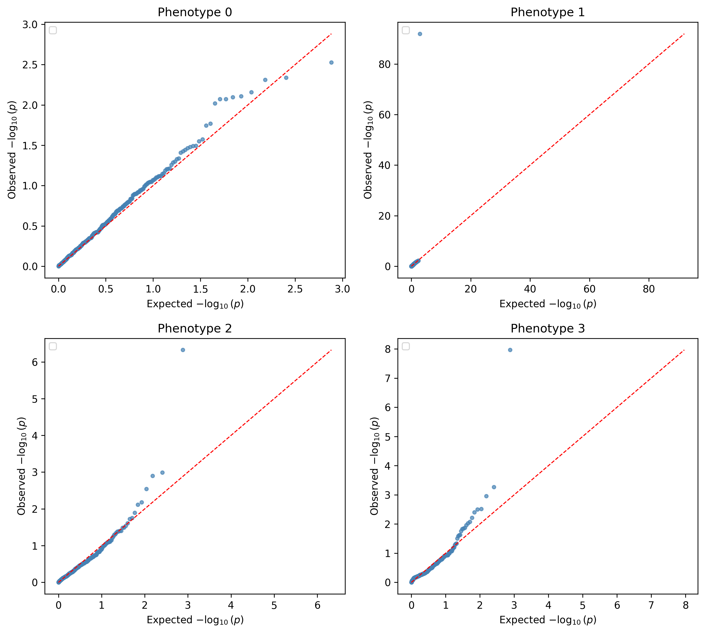
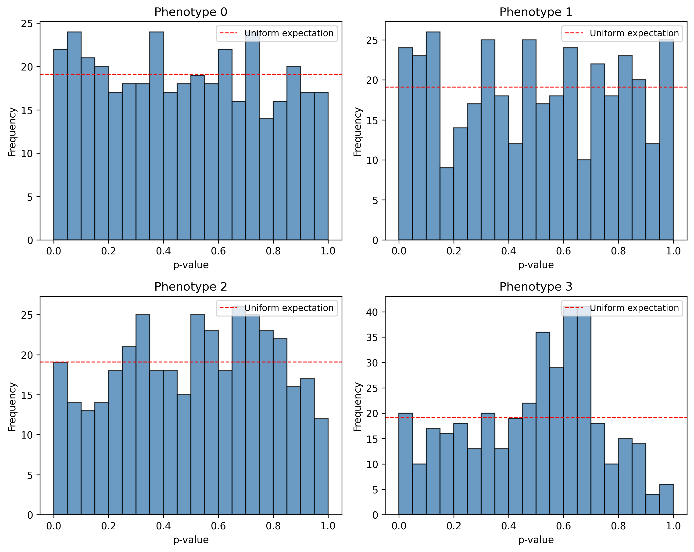
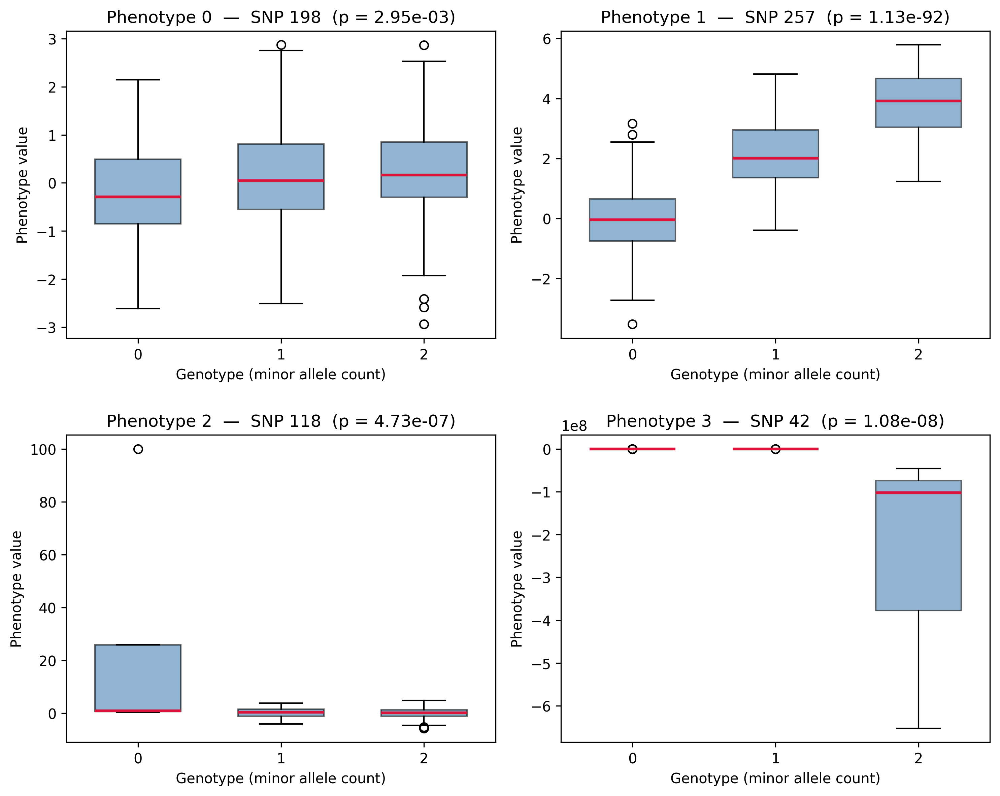
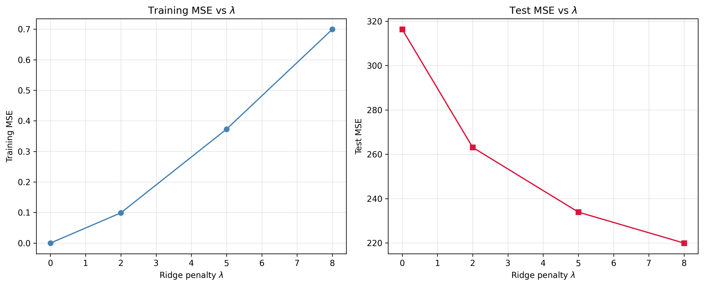

# CS C124 — Problem Set 2

GWAS and ridge regression assignment.

## Layout

```
CS_C124_PS2_Template.ipynb   # all problem-set code
ps2_data/
  Q2_data/                    # gwas.geno, gwas.pheno
  Q3_data/                    # ridge.training.{geno,pheno}, ridge.test.{geno,pheno}
ps2_results/
  Q2_data/                    # GWAS results CSV + Manhattan / QQ / histogram / boxplot PNGs
  Q3_data/                    # ridge MSE results CSV + MSE vs λ plot
```

## Q2 — GWAS

Single-SNP linear regression (statsmodels OLS) of each phenotype on each SNP. Per-regression coefficients, SEs, t-stats, p-values, and Bonferroni flag are saved to [ps2_results/Q2_data/gwas_results.csv](ps2_results/Q2_data/gwas_results.csv).

**Manhattan plots** — −log₁₀(p) vs SNP index per phenotype; red dashed line is the Bonferroni threshold (α = 0.05 / M).


**QQ plots** — observed vs expected −log₁₀(p) under the uniform null; deviation above the diagonal indicates signal.



**p-value histograms** — under the null, p-values are ~Uniform(0,1); spikes near 0 indicate true associations.



**Genotype vs phenotype boxplots** — phenotype distribution stratified by genotype (0/1/2 minor alleles), pooled across all SNPs per phenotype.



## Q3 — Ridge regression

Closed-form ridge `β = (XᵀX + λI)⁻¹ Xᵀy` fit on training data, evaluated on held-out test data for λ ∈ {0.001, 2, 5, 8}. Full results in [ps2_results/Q3_data/ridge_results.csv](ps2_results/Q3_data/ridge_results.csv):

| λ      | Training MSE | Test MSE |
| ------ | -----------: | -------: |
| 0.001  | 4.75e-08     | 316.34   |
| 2      | 0.0990       | 263.10   |
| 5      | 0.3729       | 233.92   |
| 8      | 0.6994       | 219.95   |

As λ increases, training MSE rises (less freedom to fit) while test MSE drops (less overfitting) — within the tested range, λ = 8 generalizes best.



## Running

Open `CS_C124_PS2_Template.ipynb` in Jupyter and run cells top-to-bottom. Requires `numpy`, `pandas`, `matplotlib`, `statsmodels`.
